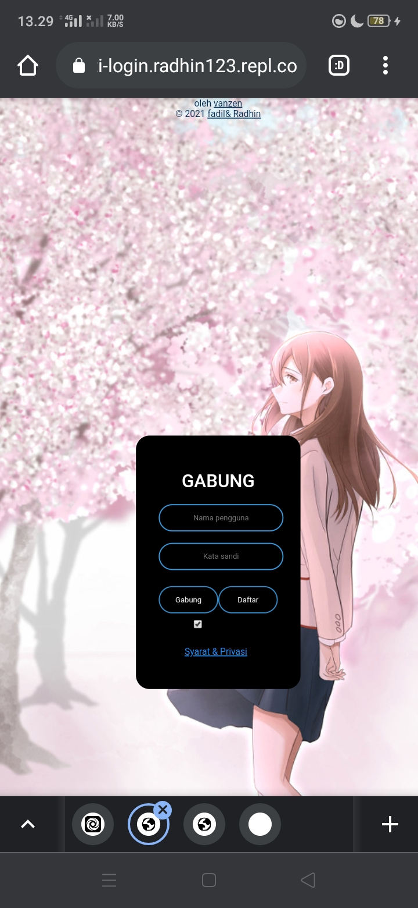

### < h1  align = "center" > source code untuk aktivitas login website </ h1 >

<i> <b> create by Fadi</b> </i>

#
#### contact me

   
 <a href="https://github.com/radhin123">My github</a>  
#

#">
24
#
<img src=" https://github.com/radhin123/radhin123/blob/main/Ngentod/status_me_status_90e259db678545f49a41faf12e095d58.jpg " width="640" title="Menu" alt="Menubg.jpg
kami
